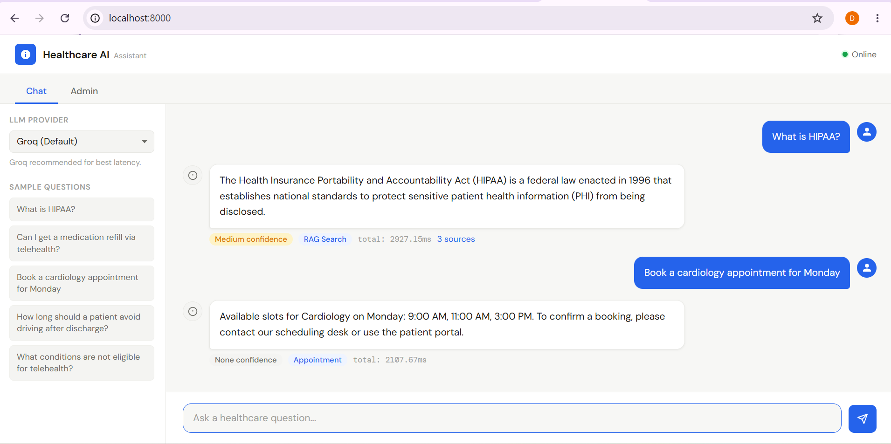
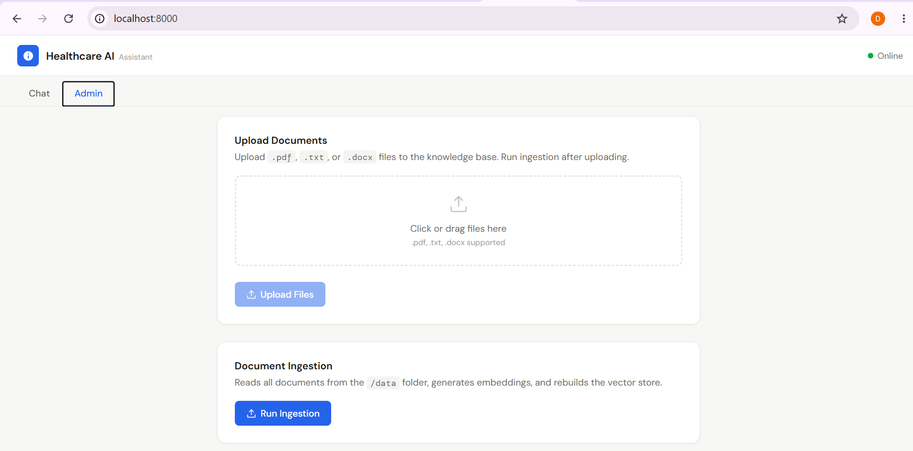

# Healthcare AI Assistant



---

A RAG-based healthcare AI assistant that answers questions from internal clinical, operational, and compliance documents. Built with hybrid search, multi-provider LLM support, and streaming responses.

---

## Features

- Hybrid search — BM25 lexical + FAISS semantic retrieval with RRF merging
- LLM-based agentic routing — classifies intent then routes to RAG or appointment tool
- Streaming responses via Server-Sent Events
- Multi-provider LLM — Groq (default) and Ollama (local)
- Source citations with chunk-level references
- Confidence scoring — High / Medium / Low based on retrieval similarity
- Admin panel — document upload, ingestion, vector store management
- Docker ready with persistent volumes

---

## Tech Stack

| Layer            | Technology                             |
| ---------------- | -------------------------------------- |
| Backend          | FastAPI (async)                        |
| Embeddings       | sentence-transformers/all-MiniLM-L6-v2 |
| Vector Store     | FAISS (in-memory, persisted to disk)   |
| Lexical Search   | BM25 (rank-bm25)                       |
| LLM Providers    | Groq API, Ollama (local)               |
| Frontend         | HTML / CSS / Vanilla JS                |
| Containerization | Docker + Docker Compose                |

---

## Project Structure

```
healthcare-ai-assistant/
├── app/
│   ├── main.py              # FastAPI app + lifespan
│   ├── config.py            # Settings from .env
│   ├── routes/
│   │   ├── health.py        # GET /health
│   │   ├── ingest.py        # POST /ingest, POST /upload, POST /clear-db
│   │   ├── ask.py           # POST /ask
│   │   └── stream.py        # POST /ask/stream (SSE)
│   ├── services/
│   │   ├── agent.py         # Intent classification + routing
│   │   ├── retriever.py     # Hybrid BM25 + FAISS + RRF
│   │   ├── embeddings.py    # MiniLM embedding model
│   │   ├── vector_store.py  # FAISS index + BM25 + metadata
│   │   ├── loader.py        # PDF / DOCX / TXT loader
│   │   ├── chunker.py       # Sliding window chunker
│   │   ├── confidence.py    # Cosine similarity scoring
│   │   └── streamer.py      # SSE streaming generator
│   ├── prompts/
│   │   └── rag_prompt.py    # System prompt + builder
│   ├── tools/
│   │   └── appointment.py   # Mock appointment slot checker
│   └── models/
│       └── schemas.py       # Pydantic request/response models
├── data/                    # Place documents here (.pdf, .txt, .docx)
├── frontend/
│   └── index.html           # Chat UI + Admin panel
├── tests/
│   ├── conftest.py
│   ├── test_health.py
│   ├── test_ingest.py
│   └── test_ask.py
├── vector_store/            # Auto-generated after /ingest
├── logs/                    # Auto-generated at runtime
├── Dockerfile
├── docker-compose.yml
├── requirements.txt
└── .env.example
```

---

## Setup

### 1. Clone and create environment

```bash
git clone https://github.com/devang30github/healthcare-ai-assistant
cd healthcare-ai-assistant
python -m venv .venv
.venv\Scripts\activate      # Windows
source .venv/bin/activate   # Mac/Linux
```

### 2. Install dependencies

```bash
pip install -r requirements.txt
```

### 3. Configure environment

```bash
cp .env.example .env
```

Edit `.env` and set your keys:

```env
GROQ_API_KEY=your_groq_api_key_here
OLLAMA_BASE_URL=http://localhost:11434
OLLAMA_MODEL=Gemma2:2b
```

Get a free Groq API key at [console.groq.com](https://console.groq.com)

### 4. Add documents

Place `.pdf`, `.txt`, or `.docx` files in the `/data` folder. Sample documents are included.

### 5. Run the server

```bash
uvicorn app.main:app --reload
```

Open `http://localhost:8000`

---

## Docker

### Using Docker Compose

```bash
# Build and start
docker compose up --build

# Run in background
docker compose up --build -d
```

> **Ollama:** If using Ollama, run it natively on your machine. The app connects to `host.docker.internal:11434` automatically on Windows/Mac Docker Desktop.

### App only

```bash
docker build -t healthcare-ai .
docker run -p 8000:8000 --env-file .env healthcare-ai
```

---

## API Endpoints

| Method | Endpoint      | Description                              |
| ------ | ------------- | ---------------------------------------- |
| GET    | `/health`     | Service health check                     |
| POST   | `/upload`     | Upload documents to /data                |
| POST   | `/ingest`     | Process documents and build vector store |
| POST   | `/ask`        | Ask a question (full response)           |
| POST   | `/ask/stream` | Ask a question (SSE streaming)           |
| POST   | `/clear-db`   | Clear the vector store                   |

### POST /ask

```bash
curl -X POST http://localhost:8000/ask \
  -H "Content-Type: application/json" \
  -d '{"question": "Can a patient request a medication refill through telehealth?", "provider": "groq"}'
```

Response:

```json
{
  "answer": "Yes, patients can request medication refills during telehealth visits provided the medication is already prescribed and does not require an in-person evaluation.",
  "sources": [
    {
      "document": "telehealth_policy.txt",
      "chunk_id": 2,
      "chunk": "Medication refill requests may be reviewed during telehealth visits..."
    }
  ],
  "confidence": "high",
  "provider_used": "groq",
  "tool_used": "rag_search",
  "intent_ms": 0.4,
  "retrieval_time_ms": 48.2,
  "generation_time_ms": 743.1,
  "total_time_ms": 812.6
}
```

### POST /ask — appointment routing

```bash
curl -X POST http://localhost:8000/ask \
  -H "Content-Type: application/json" \
  -d '{"question": "Can I book a cardiology appointment for Monday?", "provider": "groq"}'
```

Response:

```json
{
  "answer": "Available slots for Cardiology on Monday: 9:00 AM, 11:00 AM, 3:00 PM. To confirm a booking, please contact our scheduling desk or use the patient portal.",
  "sources": [],
  "confidence": "none",
  "tool_used": "appointment_tool",
  ...
}
```

---

## RAG Pipeline

```
User Question
      │
      ├──────────────────────────────────┐
      │                                  │
 Intent Classification             Hybrid Retrieval
 (keyword scoring +                BM25 top-5 +
  LLM fallback if ambiguous)       FAISS top-5
      │                                  │
      └──────────────┬───────────────────┘
                     │
               RRF Merge → Top 3 chunks
                     │
              Confidence Score
              (avg cosine similarity)
                     │
           ┌─────────┴──────────┐
           │                    │
      confidence=none      confidence ok
           │                    │
      Fallback response    Build prompt +
                           LLM generation
                                │
                          Streaming response
                          + source citations
```

---

## Prompt Strategy

The system prompt enforces grounded answers:

- Answer **only** from retrieved context
- Never guess or speculate
- If answer not found → return fallback message
- No inline source citations — sources returned as a separate field
- No direct medical diagnosis or unsafe medical advice

Fallback response: `"I could not find this information in the provided documents."`

---

## Agentic Workflow

Intent is classified in two steps:

1. **Keyword scoring** — weighted keyword matching, returns in <1ms for clear cases
2. **LLM fallback** — `llama-3.1-8b-instant` via Groq, only called for ambiguous queries (~5-10%)

Intent classification and retrieval run **concurrently** via `ThreadPoolExecutor` — saves ~70ms per request.

Routing:

- `appointment` → extracts department + day → `check_available_slots()` mock tool
- `knowledge` → RAG pipeline → LLM generation

---

## LLM Configuration

| Provider | Model                    | Use                        |
| -------- | ------------------------ | -------------------------- |
| Groq     | llama-3.3-70b-versatile  | Generation (default)       |
| Groq     | llama-3.1-8b-instant     | Intent classification only |
| Ollama   | Gemma2:2b (configurable) | Local / offline generation |

Switch providers via the frontend dropdown or `"provider"` field in the API request.

---

## Embedding and Retrieval

| Setting                 | Value                      |
| ----------------------- | -------------------------- |
| Embedding model         | all-MiniLM-L6-v2 (384 dim) |
| Chunk size              | 400 chars                  |
| Chunk overlap           | 80 chars                   |
| BM25 top-K              | 5                          |
| FAISS top-K             | 5                          |
| Final top-K (after RRF) | 3                          |
| Confidence High         | cosine avg ≥ 0.75          |
| Confidence Medium       | cosine avg ≥ 0.50          |
| Confidence Low          | cosine avg < 0.50          |

---

## Running Tests

```bash
pytest tests/ -v
```

Tests use mocked LLM calls — no API key or network required.

---

## Dataset

Synthetic healthcare documents in `/data` — no real patient data or PHI used:

- `telehealth_guidelines.pdf`
- `patient_discharge_instructions.pdf`
- `data\hipaa_insurance_faq.pdf`

---

## Known Limitations

- Vector store is single-user and in-memory — not suitable for multi-user production without Redis or a proper vector DB
- Ollama generation is slow on CPU (~3-5s) — GPU recommended for local use
- Appointment tool is a mock — no real scheduling system integration

## Future Improvements

- Redis caching for repeated queries
- Authentication
- Persistent multi-user vector store (Weaviate / Pinecone)
- Reranking with cross-encoder model
- Kubernetes deployment
- Real appointment system integration

---

## PHI and Healthcare Compliance

- No real patient data used anywhere in this project
- All telehealth sessions described in documents are noted as HIPAA-compliant encrypted channels
- In production: PHI would require end-to-end encryption, audit logging, BAA with cloud providers, and role-based access control
